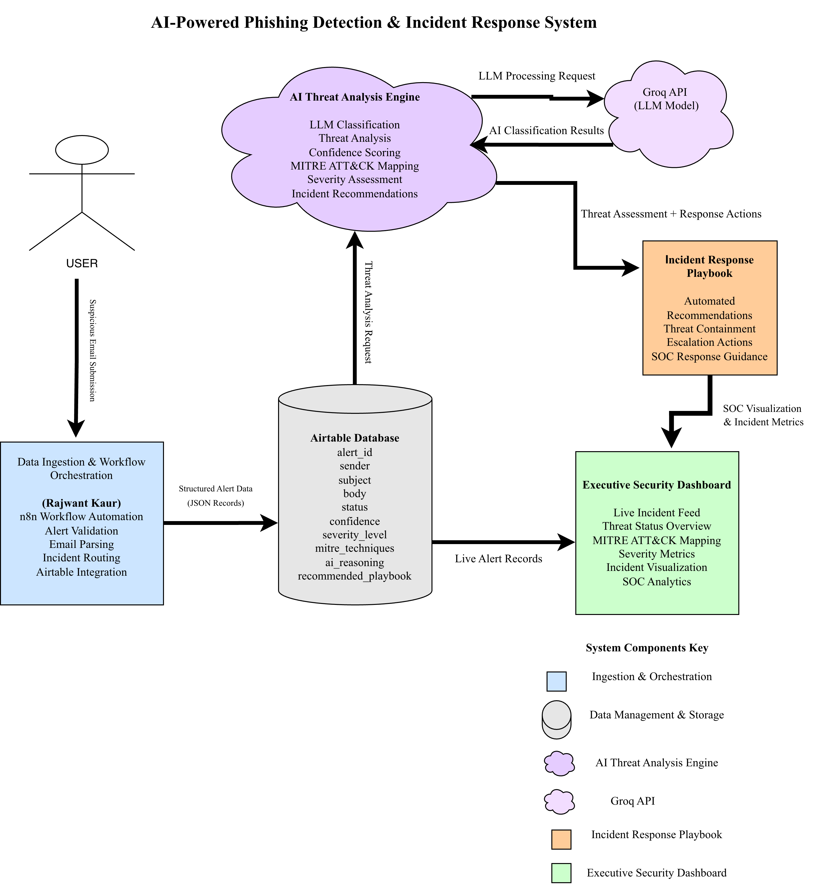

# AI-Powered Phishing Detection & Incident Response System

Enterprise-level AI-powered phishing detection and incident response workflow built using n8n, Airtable, Flowise, and Groq LLM.

---

# Project Overview

This project simulates a modern Security Operations Center (SOC) workflow for detecting, analyzing, classifying, and responding to phishing attacks using AI-driven automation.

The system automates the complete incident lifecycle:

- Suspicious email ingestion
- AI-based phishing analysis
- Confidence scoring
- MITRE ATT&CK mapping
- Severity classification
- Automated response recommendations
- Executive dashboard visualization
- Incident response orchestration

The workflow demonstrates how enterprise cybersecurity teams can combine workflow automation, large language models, and structured threat intelligence pipelines to improve security operations.

---

# System Architecture

## Enterprise Security Workflow



---

# Core Technologies

| Technology | Purpose |
|---|---|
| n8n | Workflow automation and orchestration |
| Airtable | Structured alert storage and routing |
| Flowise | AI orchestration and LLM workflows |
| Groq LLM | Threat analysis and phishing classification |
| MITRE ATT&CK | Threat technique mapping |
| Airtable Interfaces | SOC dashboard visualization |

---

# Workflow Features

## Data Ingestion & Workflow Orchestration

- Automated suspicious email ingestion
- Email parsing and validation
- Structured JSON alert generation
- Incident routing logic
- Airtable integration

## AI Threat Analysis Engine

- AI-powered phishing detection
- Threat classification
- Confidence scoring
- Severity assessment
- MITRE ATT&CK mapping
- Incident recommendation generation

## Incident Response Automation

- Automated containment recommendations
- Escalation guidance
- SOC response recommendations
- Threat prioritization

## Executive Security Dashboard

- Live incident feed
- Threat status overview
- Alert metrics visualization
- Incident analytics
- SOC monitoring interface

---

# Project Workflow

The workflow follows a complete enterprise incident response lifecycle:

```text
Suspicious Email
        ↓
n8n Workflow Automation
        ↓
Airtable Alert Storage
        ↓
AI Threat Analysis Engine
        ↓
MITRE ATT&CK Mapping
        ↓
Incident Response Playbook
        ↓
Executive Security Dashboard
